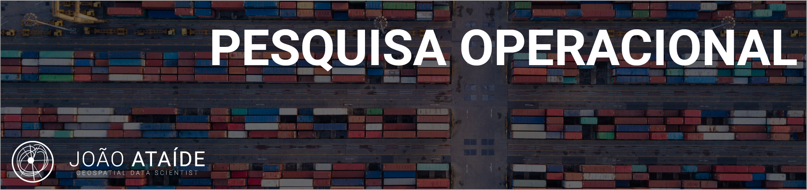

  

# João Ataíde
*Cientista de Dados na Imagem Esri*

---
Esse aqui é meu reporitório de Pesquisa Operacional, neste realizou pequenos cases de estudo no qual procuro otimizar processos e resolver problemas utilizando otimização matemática.

**Background in:** Pyomo, DEAP, Algoritimos Genéticos, Pesquisa Operacional, Otimização Discreta.

---

**Contatos:**
* [Blog](https://www.joaoataide.com)
* [LinkedIn](https://www.linkedin.com/in/joaoataidee/)

**Projetos:**
Veja os projetos publicados no meu blog:

* **Classificação de Roupas usando TensorFlow:**[ Projeto](https://www.joaoataide.com/post/classificação-de-roupas-com-tensorflow)
* **Analisar os termos mais frequentes em artigos do COVID-19:**[ Projeto](https://www.joaoataide.com/post/desafio-kaggle-covid-19)
* **Estimativa de evapotranspiração:**[ Projeto](https://www.joaoataide.com/post/estimativa-da-evapotranspiração)
* **Análise de ocupação irregular de Linhas de Transmissão:**[ Projeto](https://www.joaoataide.com/post/linhas-de-transmissão)
* **Vetorização semiautomática de áreas urbanas:** [ Projeto](https://www.joaoataide.com/post/vetorização-semiautomática)
* **Comparação dos Levantamento Cartográficos Pré e Pós Processado:**[ Projeto](https://www.joaoataide.com/post/pós-e-pré-processados)
---

